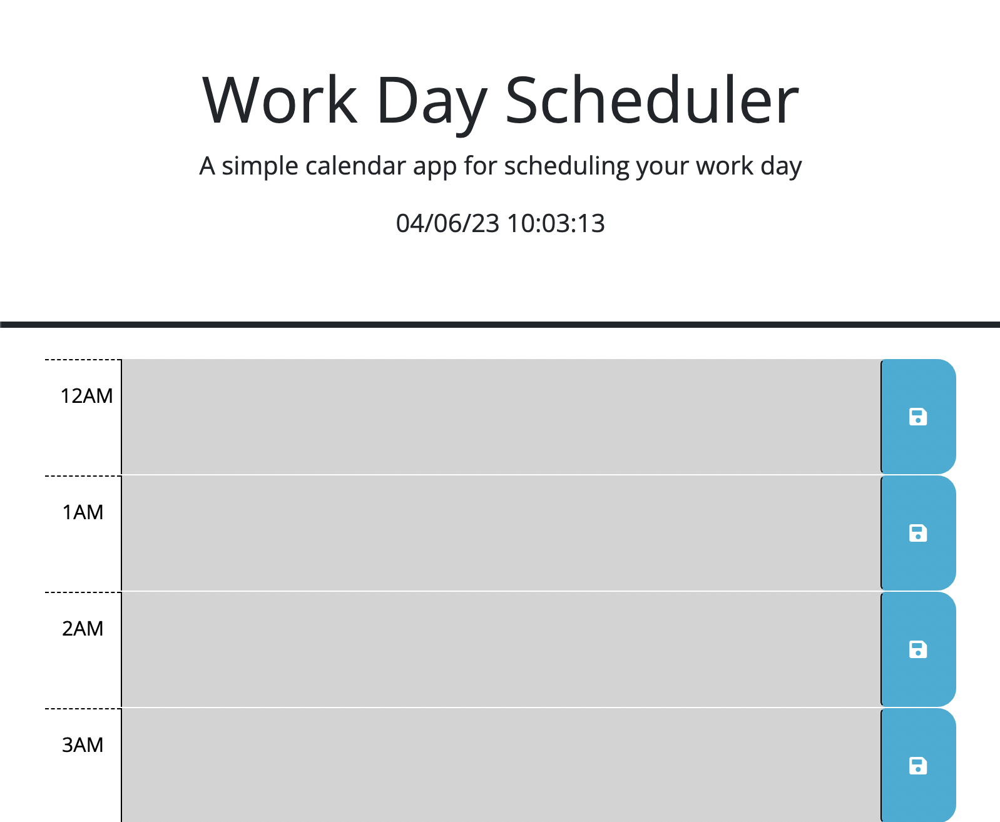
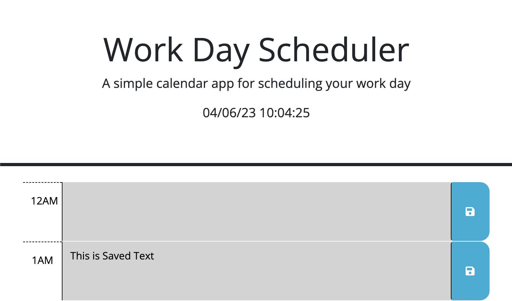

# 05 Third-Party APIs: Work Day Scheduler

## Technology Used 

| Technology Used         | Resource URL           | 
| ------------- |:-------------:| 
| HTML    | [https://developer.mozilla.org/en-US/docs/Web/HTML](https://developer.mozilla.org/en-US/docs/Web/HTML) | 
| JavaScript | [https://developer.mozilla.org/en-US/docs/Web/JavaScript](https://developer.mozilla.org/en-US/docs/Web/JavaScript)|   
| Git | [https://git-scm.com/](https://git-scm.com/)     |      

## Description 

[Visit the Deployed Site](https://jeppjeppjepp0.github.io/ThirdPartyApiProject/)

This project required students to use 3rd party APIs to manipulate the HTML of a webpage. The two APIs used were jQuery and dayJS. The full acceptance criteria are provided below: 

```md
GIVEN I am using a daily planner to create a schedule
WHEN I open the planner
THEN the current day is displayed at the top of the calendar
WHEN I scroll down
THEN I am presented with timeblocks for standard business hours
WHEN I view the timeblocks for that day
THEN each timeblock is color coded to indicate whether it is in the past, present, or future
WHEN I click into a timeblock
THEN I can enter an event
WHEN I click the save button for that timeblock
THEN the text for that event is saved in local storage
WHEN I refresh the page
THEN the saved events persist
```

## Table of Contents

* [Code Example](#code-example)
* [Usage](#usage)
* [Learning Points](#learning-points)
* [Author Info](#author-info)

## Code Example

One important piece of code that I wrote was the coloring system that changes with time. The following snippet of code shows how I used `dayjs()` to set the current hour. Since `dayjs()` can return hours that match the index of my `allHoursArray` by using the `.format()` method, I directly compared the current hour to the index of the array, and colored accordingly by setting the classes of each element in the array. 

```js
var currentHour = dayjs().format("HH");

for (var i = 0; i < allHoursArray.length; i++){
    // set past
    if (i < currentHour){
        allHoursArray[i].attr("class","row time-block past");
    }
    // set present
    else if (i == currentHour) {
        allHoursArray[i].attr("class","row time-block present");
    }
    // set future
    else {
        allHoursArray[i].attr("class","row time-block future");
    }
}
```


## Usage 

This site will load with an indicator of the current date and time. The page also loads with colored indicators to show what hour of the day it is, with gray indicating the past, red indicating the present, and green indicating the future.



Users can click on each card element to enter tasks or other information to be associated with that time. By clicking the blue save button, the information is then stored to local storage, and will persist on the page, even after refresh (as seen below).




## Learning Points 

Below are the following topics/methods that I learned through this project:

 * [jQuery](https://api.jquery.com/)
 * [dayjs().format()](https://day.js.org/docs/en/display/format)
 * [JSON.parse()](https://developer.mozilla.org/en-US/docs/Web/JavaScript/Reference/Global_Objects/JSON/parse)
 * [JSON.stringify()](https://developer.mozilla.org/en-US/docs/Web/JavaScript/Reference/Global_Objects/JSON/stringify)


## Author Info

### Jedd Javier

* [LinkedIn](https://www.linkedin.com/in/jedd-javier-4b323426b/)
* [Github](github.com/jeppjeppjepp0)
